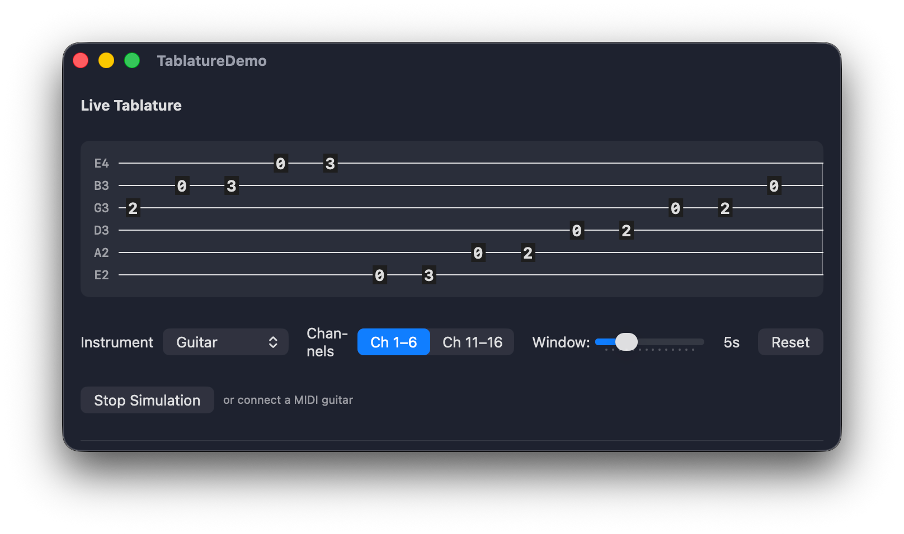

# Tablature

[](https://swift.org)
[](https://developer.apple.com)
[](LICENSE)

A SwiftUI package for guitar, bass, and any stringed instrument tablature visualization. Part of the [AudioKit](https://audiokit.io) ecosystem.



## Installation

Add Tablature via Swift Package Manager:

```swift
dependencies: [
    .package(url: "https://github.com/AudioKit/Tablature.git", from: "1.0.0")
]
```

## Quick Start

### Static Tablature

Build a passage from measures and notes, then render it:

```swift
import SwiftUI
import Tablature

struct ContentView: View {
    var body: some View {
        TablatureView(sequence: .smokeOnTheWater)
    }
}
```

Or construct your own:

```swift
let measure = TabMeasure(
    duration: 4.0,
    notes: [
        TabNote(string: 3, fret: 0, time: 0),
        TabNote(string: 3, fret: 3, time: 1),
        TabNote(string: 3, fret: 5, time: 2),
    ]
)
let sequence = TabSequence(instrument: .guitar, measures: [measure])

TablatureView(sequence: sequence)
```

### Live Scrolling Tablature

For real-time input (e.g., MIDI guitar), use `LiveTablatureView`:

```swift
@StateObject var model = LiveTablatureModel(instrument: .guitar, timeWindow: 5.0)

var body: some View {
    LiveTablatureView(model: model)
}

// Feed notes as they arrive:
model.addNote(string: 0, fret: 5)
```

### Theming

Customize appearance with `TablatureStyle`:

```swift
TablatureView(sequence: .smokeOnTheWater)
    .tablatureStyle(TablatureStyle(
        stringSpacing: 24,
        measureWidth: 400,
        fretColor: .blue,
        lineColor: .gray
    ))
```

## Features

- **Static tablature** — render pre-built `TabSequence` passages with bar lines, fret numbers, and string labels
- **Live scrolling tablature** — real-time rendering with `Canvas` + `TimelineView` for smooth frame-rate updates
- **Instrument presets** — guitar, 7-string, drop-D, bass (4/5/6-string), ukulele, banjo, or define your own
- **MIDI-to-fret conversion** — create notes from MIDI note numbers with automatic fret derivation
- **Articulations** — bend, hammer-on, pull-off, slide, and pitch-bend arrow annotations
- **Theming** — configurable colors, fonts, spacing, and sizing via environment values
- **Dark/light mode** — adaptive defaults out of the box
- **Any string count** — layout driven by `StringInstrument`, not hardcoded to 6
- **Memory-bounded** — live model prunes off-screen notes automatically
- **Dependency-free** — no external dependencies in the library itself

## Demo App

The demo app shows MIDI guitar integration using MIDIKit (demo-only dependency):

```bash
xcodebuild build -project Demo/TablatureDemo.xcodeproj \
    -scheme TablatureDemo -destination "platform=macOS"
```

## Build & Test

```bash
swift build    # Build the library
swift test     # Run tests
```

## License

MIT. See [LICENSE](LICENSE) for details.
